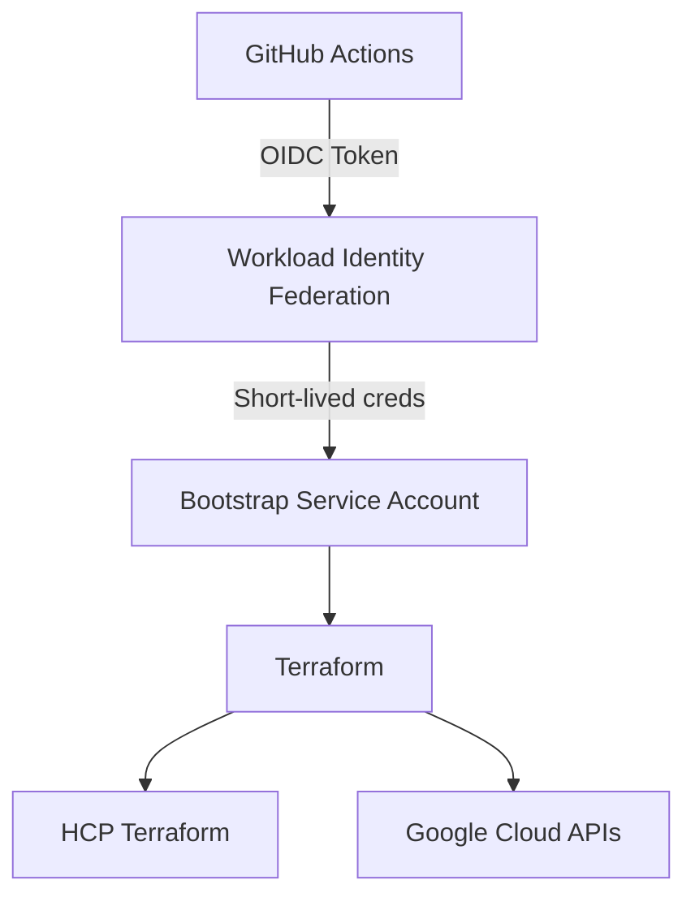

&nbsp;
&nbsp;
&nbsp;
&nbsp;
&nbsp;
&nbsp;
&nbsp;
&nbsp;
&nbsp;
&nbsp;


# GCP Terraform Bootstrap

## Overview

**gcp-terraform-bootstrap** provides a secure, repeatable foundation for bootstrapping **Google Cloud Platform (GCP)** projects using **Terraform**.

This repository represents the **platform bootstrap layer** and is intentionally designed to be executed **once per project (or infrequently)**.

It is responsible for:

- Enabling required **GCP APIs**
- Creating **project- and repository-scoped service accounts**
- Applying **project-level IAM bindings**
- Establishing **OIDC-based trust** between GitHub Actions and GCP

Authentication is **keyless**, using **GitHub Actions OIDC + Workload Identity Federation (WIF)**.  
Terraform state is stored in **HCP Terraform** for auditability and state safety.

---

## Key Features

- 🔐 **Keyless authentication**
  - GitHub Actions OIDC
  - Google Cloud Workload Identity Federation
- 🏗️ **Platform bootstrap pattern**
  - Root-of-trust execution
  - Clear separation from workloads
- ☁️ **HCP Terraform remote state**
  - Centralized state
  - Locking, run history, audit trail
- 📦 **Data-driven Terraform**
  - Minimal resource blocks
  - IAM and service accounts defined via maps
- 🔒 **Least privilege by design**
  - Explicit permissions
  - No shared credentials

---

## Repository Responsibilities

### What this repository manages

- `google_project_service` (API enablement)
- Bootstrap and workload service accounts
- Project-level IAM bindings
- Root-of-trust execution

### What this repository intentionally avoids

- Workload resources (GCS, BigQuery, Composer, etc.)
- Application-level IAM
- Environment-specific infrastructure

Those concerns belong in **downstream workload repositories**.

---

## Repository Structure

```text
.
├── infra/
│   └── gcp/
│       └── tf/
│           ├── backends.tf
│           ├── data.tf
│           ├── locals.tf
│           ├── main.tf
│           ├── outputs.tf
│           ├── providers.tf
│           ├── terraform.auto.tfvars.json
│           └── variables.tf
└── .github/
    ├── dependabot.yaml
    └── workflows/
        ├── bootstrap-terraform.yaml
        ├── ci.yaml
        ├── create-branch.yaml
        ├── notify.yaml
        └── terraform-destroy.yaml
```

---

## 🧠 Bootstrap Lifecycle: Day-0 / Day-1 / Day-2

This repository follows a **three-phase bootstrap lifecycle**, commonly used by platform and cloud foundation teams.

| Phase | Purpose | Human Involvement |
|-----|--------|------------------|
| **Day-0** | Establish identity & trust | Manual (one-time) |
| **Day-1** | CI/CD becomes operational | Automated |
| **Day-2** | Ongoing operations & scale | Fully automated |

Think of it as:
- **Day-0** → create the *keys to the kingdom*
- **Day-1** → pipelines build the platform
- **Day-2** → operate, extend, and harden

---

# 🟦 DAY-0: Identity & Trust Bootstrap (One-Time)

> Goal: Create the **root of trust** so Terraform can run securely without keys.

### Why a Bootstrap Service Account Is Required

Terraform requires credentials *before* it can create any resources.

To avoid a circular dependency:
> “Terraform needs a service account to create service accounts”

we manually create **one bootstrap service account**, which:
- Exists **before Terraform**
- Is used **only** to run bootstrap Terraform
- Authenticates **keylessly** via GitHub Actions OIDC

---

### Step 1 — Authenticate with Google Cloud

```bash
gcloud auth login --no-launch-browser
gcloud auth application-default login
```

---

### Step 2 — Create the Bootstrap Service Account

```bash
PROJECT_ID="gcp-projects-xxxxx"

gcloud config set project "$PROJECT_ID"

gcloud iam service-accounts create tf-bootstrap-sa \
  --display-name="Terraform Bootstrap Executor"
```

---

### Step 3 — Grant Minimal Permissions

```bash
BOOTSTRAP_SA="tf-bootstrap-sa@${PROJECT_ID}.iam.gserviceaccount.com"

gcloud projects add-iam-policy-binding "$PROJECT_ID" \
  --member="serviceAccount:$BOOTSTRAP_SA" \
  --role="roles/serviceusage.serviceUsageAdmin"

gcloud projects add-iam-policy-binding "$PROJECT_ID" \
  --member="serviceAccount:$BOOTSTRAP_SA" \
  --role="roles/iam.serviceAccountAdmin"

gcloud projects add-iam-policy-binding "$PROJECT_ID" \
  --member="serviceAccount:$BOOTSTRAP_SA" \
  --role="roles/resourcemanager.projectIamAdmin"
```

These permissions allow the bootstrap to:
- Enable APIs
- Create service accounts
- Bind IAM roles

---

### Step 4 — Configure GitHub Actions OIDC (WIF)

```bash
PROJECT_NUMBER="$(gcloud projects describe "$PROJECT_ID" --format='value(projectNumber)')"

POOL_ID="subhamay-projects-github-pool"
PROVIDER_ID="github"

GITHUB_OWNER="subhamay-bhattacharyya"
GITHUB_REPO="gcp-terraform-bootstrap"
```

#### Create Workload Identity Pool

```bash
gcloud iam workload-identity-pools create "$POOL_ID" \
  --location=global \
  --display-name="GitHub Actions Pool"
```

#### Create GitHub OIDC Provider

```bash
gcloud iam workload-identity-pools providers create-oidc "$PROVIDER_ID" \
  --location=global \
  --workload-identity-pool="$POOL_ID" \
  --issuer-uri="https://token.actions.githubusercontent.com" \
  --attribute-mapping="google.subject=assertion.sub,attribute.repository=assertion.repository,attribute.ref=assertion.ref" \
  --attribute-condition="string(assertion.repository).startsWith('${GITHUB_OWNER}/')"
```

#### Allow Only This Repo to Impersonate

```bash
gcloud iam service-accounts add-iam-policy-binding "$BOOTSTRAP_SA" \
  --role="roles/iam.workloadIdentityUser" \
  --member="principalSet://iam.googleapis.com/projects/$PROJECT_NUMBER/locations/global/workloadIdentityPools/$POOL_ID/attribute.repository/$GITHUB_OWNER/$GITHUB_REPO"
```

---

# 🟩 DAY-1: CI/CD Becomes Operational

> Goal: Terraform runs fully automated via GitHub Actions.

### GitHub Repository / Organization  Trump Secrets

| Secret | Description |
|-----|-----|
| `TF_TOKEN_APP_TERRAFORM_IO` | HCP Terraform token |
| `GCP_WIF_PROVIDER` | Full WIF provider resource name |
| `GCP_BOOTSTRAP_SA` | Bootstrap service account email |

---

### Terraform State Management

- Backend: **HCP Terraform**
- Workspace: CLI-driven
- Organization: `Subhamay-Bhattacharyya-projects`

```hcl
terraform {
  cloud {
    organization = "subhamay-bhattacharyya-projects"
    workspaces {
      name = "gcp-terraform-bootstrap"
    }
  }
}
```

---

### Bootstrap Execution

1. Go to **Actions → bootstrap**
2. Run with `plan`
3. Review output
4. Re-run with `apply`

Terraform will:
- Enable APIs
- Create workload service accounts
- Apply IAM bindings

---

# 🟨 DAY-2: Operations & Scale

> Goal: Operate and extend safely.

Typical Day-2 actions:
- Add new workload repositories
- Create new service accounts
- Adjust IAM roles
- Tighten WIF conditions
- Enforce policies

No manual IAM changes are required.

---

## 🧠 Why This Design?

This design separates **trust establishment** from **infrastructure creation**.

### Key principles

- **Trust first, infra second**
- **No long-lived credentials**
- **Human access is temporary**
- **Scales across projects and repos**
- **Auditable and explainable**

This mirrors how **real platform teams** bootstrap cloud environments.

---

## 🧭 Authentication Flow



---

## Security Considerations

- ✅ No service account keys
- ✅ Short-lived credentials
- ✅ Repo-scoped trust
- ❌ No Owner / Editor roles
- ❌ No manual IAM drift

---

## License

MIT
