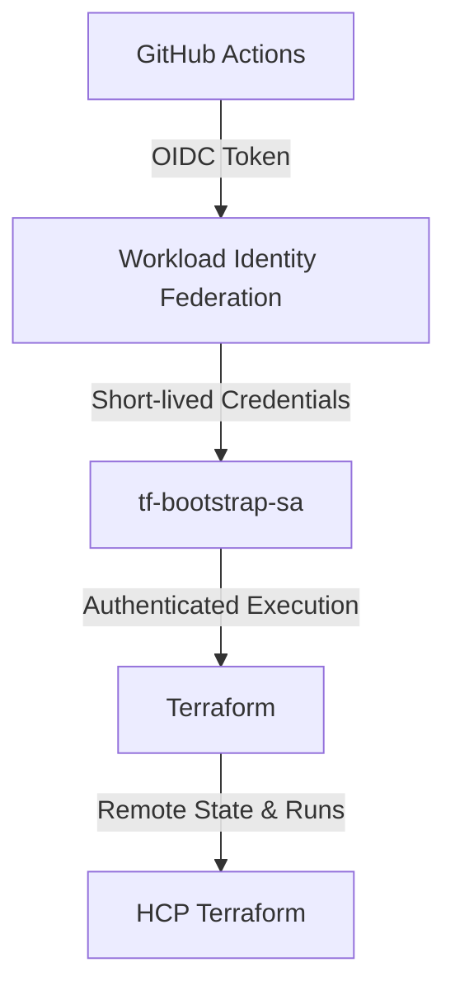
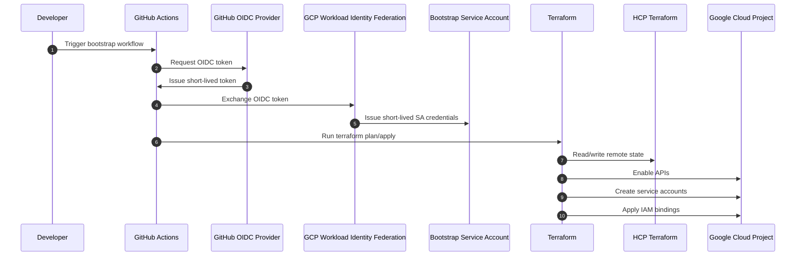

&nbsp;&nbsp;&nbsp;&nbsp;&nbsp;&nbsp;&nbsp;&nbsp;&nbsp;&nbsp;

# GCP Terraform Bootstrap

## Overview

**gcp-terraform-bootstrap** provides a secure, repeatable foundation for bootstrapping **Google Cloud Platform (GCP)** projects using **Terraform**.

This repository is responsible for:

* Enabling required **GCP APIs**
* Creating **project- and repository-specific service accounts**
* Applying **project-level IAM bindings** using least-privilege principles

It uses **modern, keyless authentication** via **GitHub Actions OIDC + Workload Identity Federation (WIF)** and stores Terraform state in **HCP Terraform**.

> This repository is intended to be executed **once per project (or infrequently)** and acts as the **platform bootstrap layer** for all downstream workload repositories.

---

## Key Features

* 🔐 **Keyless GCP authentication**

  * GitHub Actions OIDC
  * Google Cloud Workload Identity Federation
* 🏗️ **Platform bootstrap pattern**

  * API enablement
  * Service account creation
  * Centralized IAM management
* ☁️ **HCP Terraform remote state**

  * Secure state storage
  * Run history and audit trail
* 📦 **Data-driven Terraform**

  * Minimal resource blocks
  * Service accounts and roles defined via maps
* 🔒 **Least privilege by design**

  * Clear separation between bootstrap and workload responsibilities

---

## Repository Responsibilities

### What this repository manages

* `google_project_service` (API enablement)
* Project and repository-specific service accounts
* Project-level IAM bindings
* Root-of-trust bootstrap execution

### What this repository intentionally avoids

* Creating workload resources (Cloud Composer, BigQuery, GCS, etc.)
* Managing application-level IAM
* Environment-specific infrastructure

Those concerns belong in **separate workload repositories**.

---

## Repository Structure

```text
.
├── bootstrap/
│   ├── providers.tf
│   ├── variables.tf
│   ├── main.tf
│   ├── outputs.tf
│   └── terraform.auto.tfvars.json
└── .github/
    └── workflows/
        └── bootstrap.yml
```

---

## Terraform State Management

* State is stored in **HCP Terraform**
* Organization: **Subhamay-Bhattacharyya-projects**
* Workspace type: **CLI-driven workflow**

Benefits:

* Centralized state
* State locking
* Run history and audit logs
* Team-based access control

---

## Bootstrap Execution Model

### Why a Bootstrap Service Account Is Required

Terraform requires credentials *before* it can create any resources.
To avoid a circular dependency (“Terraform needs a service account to create service accounts”), this repository uses a **manually created bootstrap service account** as the **root of trust**.

This bootstrap service account:

* Exists **before Terraform runs**
* Is used **only** to execute the bootstrap Terraform
* Is authenticated **keylessly** via GitHub Actions OIDC

All other service accounts are created and managed by Terraform.

---

## Identity Model

| Identity                      | Created How     | Purpose                      |
| ----------------------------- | --------------- | ---------------------------- |
| Human user                    | Existing        | One-time setup only          |
| **Bootstrap service account** | Manually (once) | Executes bootstrap Terraform |
| Workload service accounts     | Terraform       | Used by downstream workloads |

---

## Step-by-Step Bootstrap Setup

### Step 1 — Authenticate with Google Cloud

**Authorize the Google Cloud CLI:**

```bash
gcloud auth login --no-launch-browser
```
> ℹ️ Note Use --no-launch-browser when working in remote environments (Codespaces, SSH, Cloud Shell).

> *_Common mistake (incorrect flag):_*

`gcloud auth login --no-launch-bro`

✔️ Correct flag:

`--no-launch-browser`

(Optional) Verify authentication:

```bash
gcloud auth list
```


### Step 2 — Create the Bootstrap Service Account (One Time)

> Set the active project:
```bash
gcloud config set project <PROJECT_ID>
```

```bash
# Replace xxxxx with the project id suffix
PROJECT_ID="gcp-projects-xxxxx"

gcloud iam service-accounts create tf-bootstrap-sa \
  --project="$PROJECT_ID" \
  --display-name="Terraform Bootstrap Executor"
```

---

### Step 3 — Grant Minimal Permissions to the Bootstrap Service Account

```bash
BOOTSTRAP_SA="tf-bootstrap-sa@${PROJECT_ID}.iam.gserviceaccount.com"

gcloud projects add-iam-policy-binding "$PROJECT_ID" \
  --member="serviceAccount:$BOOTSTRAP_SA" \
  --role="roles/serviceusage.serviceUsageAdmin"

gcloud projects add-iam-policy-binding "$PROJECT_ID" \
  --member="serviceAccount:$BOOTSTRAP_SA" \
  --role="roles/iam.serviceAccountAdmin"

gcloud projects add-iam-policy-binding "$PROJECT_ID" \
  --member="serviceAccount:$BOOTSTRAP_SA" \
  --role="roles/resourcemanager.projectIamAdmin"
```

These permissions allow the bootstrap to:

* Enable APIs
* Create service accounts
* Bind IAM roles

---

### Step 4 — Configure GitHub Actions OIDC with Workload Identity Federation

Configure **Workload Identity Federation (WIF)** so that **only this repository** can impersonate the bootstrap service account.

> **Actions to be performed in sequence**

#### 4.1 Set variables (adjust once)

```bash
PROJECT_ID="<YOUR_PROJECT_ID>"
PROJECT_NUMBER="$(gcloud projects describe "$PROJECT_ID" --format='value(projectNumber)')"

POOL_ID="subhamay-projects-github-pool"
PROVIDER_ID="github"

GITHUB_OWNER="subhamay-bhattacharyya"
GITHUB_REPO="gcp-terraform-bootstrap"

BOOTSTRAP_SA_ID="tf-bootstrap-sa"
BOOTSTRAP_SA_EMAIL="${BOOTSTRAP_SA_ID}@${PROJECT_ID}.iam.gserviceaccount.com"
```

#### 4.2 Create the Workload Identity Pool (one time)

```bash
gcloud iam workload-identity-pools create "$POOL_ID" \
  --project="$PROJECT_ID" \
  --location="global" \
  --display-name="GCP Projects GitHub Actions Pool"
```

#### 4.3 Create the GitHub OIDC Provider

```bash
gcloud iam workload-identity-pools providers create-oidc "$PROVIDER_ID" \
  --project="$PROJECT_ID" \
  --location="global" \
  --workload-identity-pool="$POOL_ID" \
  --display-name="GitHub Actions OIDC Provider" \
  --issuer-uri="https://token.actions.githubusercontent.com" \
  --attribute-mapping="google.subject=assertion.sub,attribute.repository=assertion.repository,attribute.ref=assertion.ref,attribute.repository_owner=assertion.repository_owner" \
  --attribute-condition="string(assertion.repository).startsWith('subhamay-bhattacharyya/')"


```

> #### Replace `subhamay-bhattacharyya` with your GitHub organization you want to grant access to GitHub OIDC


✅ This tells GCP how to trust GitHub’s OIDC tokens.

<!-- #### 4.4 Create the Bootstrap Service Account (root of trust)

```bash
gcloud iam service-accounts create "$BOOTSTRAP_SA_ID" \
  --project="$PROJECT_ID" \
  --display-name="Terraform Bootstrap Executor"
``` -->

#### 4.4 Allow only this repo to impersonate the Bootstrap SA

```bash
gcloud iam service-accounts add-iam-policy-binding "$BOOTSTRAP_SA_EMAIL" \
  --project="$PROJECT_ID" \
  --role="roles/iam.workloadIdentityUser" \
  --member="principalSet://iam.googleapis.com/projects/$PROJECT_NUMBER/locations/global/workloadIdentityPools/$POOL_ID/attribute.repository/$GITHUB_OWNER/$GITHUB_REPO"
```

<!-- #### 4.5 Grant bootstrap SA the permissions Terraform needs

```bash
gcloud projects add-iam-policy-binding "$PROJECT_ID" \
  --member="serviceAccount:$BOOTSTRAP_SA_EMAIL" \
  --role="roles/serviceusage.serviceUsageAdmin"

gcloud projects add-iam-policy-binding "$PROJECT_ID" \
  --member="serviceAccount:$BOOTSTRAP_SA_EMAIL" \
  --role="roles/iam.serviceAccountAdmin"

gcloud projects add-iam-policy-binding "$PROJECT_ID" \
  --member="serviceAccount:$BOOTSTRAP_SA_EMAIL" \
  --role="roles/resourcemanager.projectIamAdmin"

``` -->

✅ Resulting Auth Flow


This setup is performed **once per project**.

---

### Step 5 — Configure GitHub Repository Secrets

Add the following secrets to the repository:

| Secret Name                 | Description                            |  |
| --------------------------- | -------------------------------------- |--|
| `TF_TOKEN_APP_TERRAFORM_IO` | HCP Terraform API token                |`HCP Terraform API Token`|
| `GCP_WIF_PROVIDER`          | Full resource name of the WIF provider |`projects/<PROJECT_NUMBER>/locations/global/workloadIdentityPools/subhamay-projects-github-pool/providers/github`|
| `GCP_BOOTSTRAP_SA`          | Bootstrap service account email        |`tf-bootstrap-sa@<YOUR_PROJECT_ID>.iam.gserviceaccount.com`                                    |


#### Use the following CLI command to generate `GCP_WIF_PROVIDER`

```bash
PROJECT_ID="YOUR_PROJECT_ID"
POOL_ID="YOUR_POOL_ID"
PROVIDER_ID="YOUR_PROVIDER_ID"

PROJECT_NUMBER="$(gcloud projects describe "$PROJECT_ID" --format='value(projectNumber)')"

echo "projects/${PROJECT_NUMBER}/locations/global/workloadIdentityPools/${POOL_ID}/providers/${PROVIDER_ID}"

```
 > ###### Replace `subhamay-projects-github-pool` with your POOL_ID
 > ######  Replace <PROJECT_NUMBER> with the value printed in Step 3.0.
---

### Step 6 - Setup HCP Terraform workspace in your organization

In tf/backend.tf, ensure you have:

1. organization = `Your HCL Terraform Organization`
2. workspace name exactly matches what you created in HCP Terraform
3. workspace is CLI-driven (local execution)

> #### Sample backend configuration
```hcl
terraform {
  cloud {

    organization = "subhamay-bhattacharyya-projects"

    workspaces {
      name = "gcp-terraform-bootstrap"
    }
  }
}
```

### Step 7 — Run the Bootstrap Workflow

The bootstrap Terraform is executed via a **manually triggered GitHub Actions workflow**.

1. Go to **Actions → bootstrap**
2. Run with `plan`
3. Review output
4. Re-run with `apply`

Terraform will:

* Enable required GCP APIs
* Create project/repository-specific service accounts
* Apply IAM bindings

---

## Authentication Flow (End-to-End)



---

## Security Considerations

* ✅ No long-lived credentials
* ✅ No service account JSON keys
* ✅ Short-lived, auto-rotated credentials
* ✅ Repository-scoped trust boundaries
* ✅ Least-privilege IAM by default

### Explicitly avoided

* ❌ `Owner` / `Editor` roles
* ❌ Shared service accounts across repos
* ❌ Manual IAM changes outside Terraform
* ❌ Provider-level impersonation in GitHub Actions

---

## Troubleshooting

### 403 when enabling APIs

Ensure bootstrap SA has:

* `roles/serviceusage.serviceUsageAdmin`

### Cannot create service accounts

Ensure bootstrap SA has:

* `roles/iam.serviceAccountAdmin`

### IAM policy modification errors

Ensure bootstrap SA has:

* `roles/resourcemanager.projectIamAdmin`

### OIDC authentication failures

Verify:

* Correct repo name in WIF binding
* Correct `GCP_WIF_PROVIDER` secret
* `permissions: id-token: write` in workflow

### Terraform cannot connect to HCP Terraform

Verify:

* `TF_TOKEN_APP_TERRAFORM_IO` secret
* Workspace exists and is **CLI-driven**
* Token belongs to org `Subhamay-Bhattacharyya-projects`

---

## After Bootstrap Completes

Once bootstrap has successfully run:

* All required service accounts exist
* All required APIs are enabled
* Workload repositories can be created safely

From this point forward:

* All infrastructure changes are automated
* No further manual IAM or API setup is required

---

## When to Re-Run Bootstrap

* Adding new APIs
* Creating new workload service accounts
* Modifying project-level IAM
* Initial project provisioning

Not required for day-to-day workload changes.

---

## License

MIT (or your preferred license)

